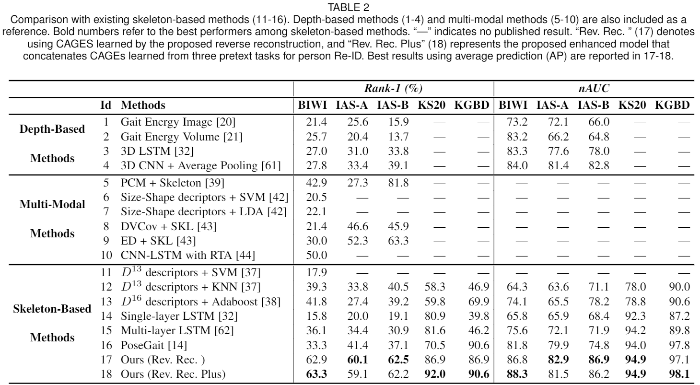
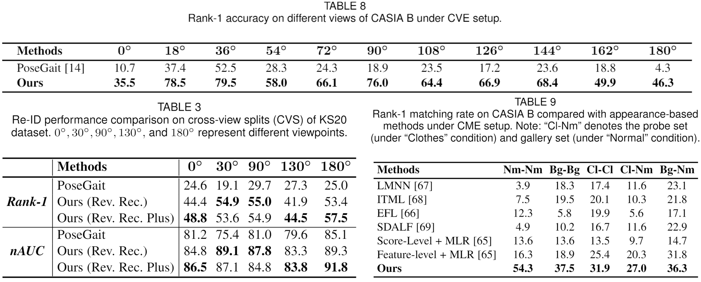

# A Self-Supervised Gait Encoding Approach with Locality-Awareness for 3D Skeleton Based Person Re-Identification
By Haocong Rao, Siqi Wang, Xiping Hu, Mingkui Tan, Huang Da, Jun Cheng, Xinwang, Liu, and Bin Hu. In [T-PAMI 2021](https://ieeexplore.ieee.org/abstract/document/9466418).
## Introduction
This is the official implementation of the self-supervised gait encoding approach presented by "A Self-Supervised Gait Encoding Approach with Locality-Awareness for 3D Skeleton Based Person Re-Identification". The codes are used to reproduce experimental results of the proposed Contrastive Attention-basd Gait Encodings (CAGEs) in the [**paper**](https://ieeexplore.ieee.org/abstract/document/9466418).


Abstract: Person re-identification (Re-ID) via gait features within 3D skeleton sequences is a newly-emerging topic with several advantages. Existing solutions either rely on hand-crafted descriptors or supervised gait representation learning. This paper proposes a self-supervised gait encoding approach that can leverage unlabeled skeleton data to learn gait representations for person Re-ID. Specifically, we first create self-supervision by learning to reconstruct unlabeled skeleton sequences reversely, which involves richer high-level semantics to obtain better gait representations. Other pretext tasks are also explored to further improve self-supervised learning. Second, inspired by the fact that motion's continuity endows adjacent skeletons in one skeleton sequence and temporally consecutive skeleton sequences with higher correlations (referred as locality in 3D skeleton data), we propose a locality-aware attention mechanism and a locality-aware contrastive learning scheme, which aim to preserve locality-awareness on intra-sequence level and inter-sequence level respectively during self-supervised learning. Last, with context vectors learned by our locality-aware attention mechanism and contrastive learning scheme, a novel feature named Constrastive Attention-based Gait Encodings (CAGEs) is designed to represent gait effectively. Empirical evaluations show that our approach significantly outperforms skeleton-based counterparts by 15-40% Rank-1 accuracy, and it even achieves superior performance to numerous multi-modal methods with extra RGB or depth information.

## Requirements
- Python 3.5
- Tensorflow 1.10.0 (GPU)

## Datasets
We provide three already pre-processed datasets (BIWI, IAS, KGBD) with various sequence lengths on <br/>
https://pan.baidu.com/s/1u5PvudgABe63A43NuaDBpA &nbsp; &nbsp; &nbsp; password：&nbsp;  ttyp <br/>
All the best models reported in our paper can be acquired on <br/> 
https://pan.baidu.com/s/1sC0mjVTAhA5qq6I73rPA_g &nbsp; &nbsp; &nbsp; password：&nbsp; g3l3  <br/> 
Please download the pre-processed datasets ``Datasets/`` and the model files ``Models/`` into the current directory. <br/><br/>
We also provide the pre-trained gait encoding models on <br/> 
https://pan.baidu.com/s/1aH0dBY5kpTaMVR9XxM89iw &nbsp; &nbsp; &nbsp; password：&nbsp; xkax  <br/> 
Please download the pre-trained gait encoding models into the directory ``Models/``. 
<br/>

The original datasets can be downloaded here: [BIWI and IAS-Lab](http://robotics.dei.unipd.it/reid/index.php/downloads), [KGBD](https://www.researchgate.net/publication/275023745_Kinect_Gait_Biometry_Dataset_-_data_from_164_individuals_walking_in_front_of_a_X-Box_360_Kinect_Sensor), [KS20.](http://vislab.isr.ist.utl.pt/datasets/#ks20)
 
Note: The access to the Vislab Multi-view KS20 dataset is available upon request. If you have signed the license agreement and been granted the right to use it, please contact me and I will share the pre-processed KS20 data.
 
## Usage

To (1) train the self-supervised gait encoding model to obtain CAGEs and (2) validate the effectiveness of CAGEs for person Re-ID on a specific dataset with a recognition network, simply run the following command: 

```bash
python train.py --dataset BIWI

# Default options: --attention LA --dataset BIWI --length 6 --t 0.1 --train_flag 1 --model rev_rec --gpu 0
# --attention: [LA, BA]  
# --dataset [BIWI, IAS, KGBD, KS20]  
# --length [4, 6, 8, 10] 
# --t [0.05, 0.1 (for BIWI/IAS/KS20), 0.5 (for KGBD), 0.8, 1.0] 
# --train_flag [1 (for training gait encoding models+RN), 0 (for training RN)] 
# --model [rev_rec, prediction, sorting, rev_rec_plus] Note that "rev_rec_plus" will train three types of models sequentially.
# --gpu [0, 1, ...]

```
Please see ```train.py``` for more details.

To print evaluation results (Re-ID Confusion Matrix / Rank-n Accuracy / Rank-1 Accuracy / nAUC) of the best model, run:

```bash
python evaluate.py --dataset BIWI --best_model rev_rec

# --dataset [BIWI, IAS, KGBD, KS20] 
# --best_model [rev_rec, rev_rec_plus] 
```
To evaluate the already trained model saved in ```Models/CAGEs_RN_models/model_name```, run:

```bash
python evaluate.py --RN_dir model_name

```
 
Please see ```evaluate.py``` for more details.

## Application to Model-Estimated Skeleton Data 
To extend our model to a large RGB-based gait dataset (CASIA B), we exploit pose estimation methods to extract 3D skeletons from RGB videos of CASIA B as follows:
- Step 1: Download [CASIA-B Dataset](http://www.cbsr.ia.ac.cn/english/Gait%20Databases.asp)
- Step 2: Extract the 2D human body joints by using [OpenPose](https://github.com/CMU-Perceptual-Computing-Lab/openpose)
- Step 3: Estimate the 3D human body joints by using [3DHumanPose](https://github.com/flyawaychase/3DHumanPose)

Here we thank (rijun.liao@gmail.com) for his contribution of extracting 3D skeleton data from CASIA B.

We provide already pre-processed skeleton data of CASIA B for Cross-View Evaluation (**CVE**) (f=20/30/40) and Condition-based Matching Evaluation (**CME**) (f=50/60/70) on <br/>
https://pan.baidu.com/s/1cRCMkHNnV0VXCgotDqS43w &nbsp; &nbsp; &nbsp; password：&nbsp;  f6x0 <br/>
Please download the two pre-processed datasets into the directory ``Datasets/``. <br/>
Note: ``CASIA/`` is used for the **CVE** setup and ``CASIA_match/`` is for the **CME** setup. 

We also provide the pre-trained gait encoding models for **CVE** setup (f=20) and **CME** setup (f=50/60/70) on <br/> 
https://pan.baidu.com/s/1qOxGRK86HaEXxJGaEdvBuQ &nbsp; &nbsp; &nbsp; password：&nbsp; phyk  <br/> 
Please download the pre-trained gait encoding models into the directory ``Models/``.  <br/>

## Usage
To (1) train the self-supervised gait encoding model to obtain frame-level CAGEs (AP) and (2) validate the effectiveness of CAGEs for person Re-ID under **CVE** setup, simply run the following command: 

```bash
python CVE-CASIA-B.py --view 0

# Default options: --attention LA --dataset CASIA_B --length 20 --view 0 --t 0.15 --train_flag 1 --gpu 0
# --attention: [LA, BA]  
# --length [20, 30, 40] 
# --view [0, 1, 2, 3, 4, 5, 6, 7, 8, 9, 10] 
# --train_flag [1 (for training gait encoding models+RN), 0 (for training RN)] 
# --gpu [0, 1, ...]

```
Please see ```CVE-CASIA-B.py``` for more details. <br/>

To (1) train the self-supervised gait encoding model to obtain sequence-level CAGEs (SC) and (2) validate the effectiveness of CAGEs for person Re-ID under **CME** setup, simply run the following command: 

```bash
python CME-CASIA-B.py --probe_type nm.nm

# Default options: --attention LA --dataset CASIA_B --length 50 --probe_type nm.nm --t 0.15 --train_flag 1 --gpu 0
# --attention: [LA, BA]  
# --length [50, 60, 70] 
# --probe_type [nm.nm, cl.cl, bg.bg, cl.nm, bg.nm] 
# --train_flag [1 (for training gait encoding models), 0 (for CME matching)] 
# --gpu [0, 1, ...]

```
Please see ```CME-CASIA-B.py``` for more details.

## Results
| **Models**                        | **Rank-1** |       |       |      |      | **nAUC** |       |       |      |      |
|-------------------------------|:------:|:-----:|:-----:|------|:----:|:----:|-------|-------|------|------|
|                               | **BIWI**   | **IAS-A** | **IAS-B** | **KS20** | **KGBD** | **BIWI** | **IAS-A** | **IAS-B** | **KS20** | **KGBD** |
| Gait Energy Image             | 21.4   | 25.6  | 15.9  |  —   |  —   | 73.2 | 72.1  | 66.0  |  —   |  —   |
| Gait Energy Volume            | 25.7   | 20.4  | 13.7  |  —   |  —   | 83.2 | 66.2  | 64.8  |  —   |  —   |
| 3D LSTM                       | 27.0   | 31.0  | 33.8  |  —   |  —   | 83.3 | 77.6  | 78.0  |  —   |  —   |
| 3D CNN + Average Pooling      | 27.8   | 33.4  | 39.1  |  —   |  —   | 84.0 | 81.4  | 82.8  |  —   |  —   |
| PCM + Skeleton                | 42.9   | 27.3  | 81.8  |  —   |  —   |  —   |  —    |  —    |  —   |  —   |
| Size-Shape Descriptors + SVM  | 20.5   |  —    |  —    |  —   |  —   |  —   |  —    |  —    |  —   |  —   |
| Size-Shape Descriptors + LDA  | 22.1   |  —    |  —    |  —   |  —   |  —   |  —    |  —    |  —   |  —   |
| DVCov + SKL                   | 21.4   | 46.6  | 45.9  |  —   |  —   |  —   |  —    |  —    |  —   |  —   |
| ED + SKL                      | 30.0   | 52.3  | 63.3  |  —   |  —   |  —   |  —    |  —    |  —   |  —   |
| CNN-LSTM with RTA             | 50.0   |  —    |  —    |  —   |  —   |  —   |  —    |  —    |  —   |  —   |
| D-13 Descriptors + SVM        | 17.9   |  —    |  —    |  —   |  —   |  —   |  —    |  —    |  —   |  —   |
| D-13 Descriptors + KNN        | 39.3   | 33.8  | 40.5  | 58.3 | 46.9 | 64.3 | 63.6  | 71.1  | 78.0 | 90.0 |
| D-16 Descriptors + Adaboost   | 41.8   | 27.4  | 39.2  | 59.8 | 69.9 | 74.1 | 65.5  | 78.2  | 78.8 | 90.6 |
| Single-layer LSTM             | 15.8   | 20.0  | 19.1  | 80.9 | 39.8 | 65.8 | 65.9  | 68.4  | 92.3 | 87.2 |
| Multi-layer LSTM              | 36.1   | 34.4  | 30.9  | 81.6 | 46.2 | 75.6 | 72.1  | 71.9  | 94.2 | 89.8 |
| PoseGait                      | 33.3   | 41.4  | 37.1  | 70.5 | 90.6 | 81.8 | 79.9  | 74.8  | 94.0 | 97.8 |
| AGEs                          | 59.1   | 56.1  | 58.2  | 86.9 | 87.7 | 86.5 | 81.7  | 85.3  | 94.9 | 96.3 |
| **CAGEs (Rev. Rec.) (Ours)**      | 62.9   | **60.1**  | **62.5**  | 86.9 | 86.9 | 86.8 | **82.9**  | **86.9**  | **94.9** | 97.1 |
| **CAGEs (Rev. Rec. Plus) (Ours)** | **63.3**   | 59.1  | 62.2  | **92.0** | **90.6** | **88.3** | 81.5  | 86.2  | **94.9** | **98.1** |

<!--  -->


## Model Size & Computational Complexity
| Methods  | # Params | GFLOPs |
|----------|----------|--------|
| PoseGait |   26.80M |  364.8 |
| [AGE](https://github.com/Kali-Hac/SGE-LA)      |    7.15M |   37.4 |
| [CAGE (Ours)](https://github.com/Kali-Hac/Locality-Awareness-SGE)     |    8.47M |    7.5 |
| [SM-SGE](https://github.com/Kali-Hac/SM-SGE)   |    5.58M |   22.6 |


## Citation
If you find this code useful for your research, please cite our paper
```bash
@article{rao2021self,
  title={A self-supervised gait encoding approach with locality-awareness for 3D skeleton based person re-identification},
  author={Rao, Haocong and Wang, Siqi and Hu, Xiping and Tan, Mingkui and Guo, Yi and Cheng, Jun and Liu, Xinwang and Hu, Bin},
  journal={IEEE Transactions on Pattern Analysis and Machine Intelligence},
  year={2021},
  publisher={IEEE}
}

@inproceedings{DBLP:conf/ijcai/RaoW0TD0020,
  author    = {Haocong Rao and
               Siqi Wang and
               Xiping Hu and
               Mingkui Tan and
               Huang Da and
               Jun Cheng and
               Bin Hu},
  title     = {Self-Supervised Gait Encoding with Locality-Aware Attention for Person
               Re-Identification},
  booktitle = {IJCAI},
  pages     = {898--905},
  publisher = {ijcai.org},
  year      = {2020}
}

```


## License

Locality-Awareness-SGE is released under the MIT License.
